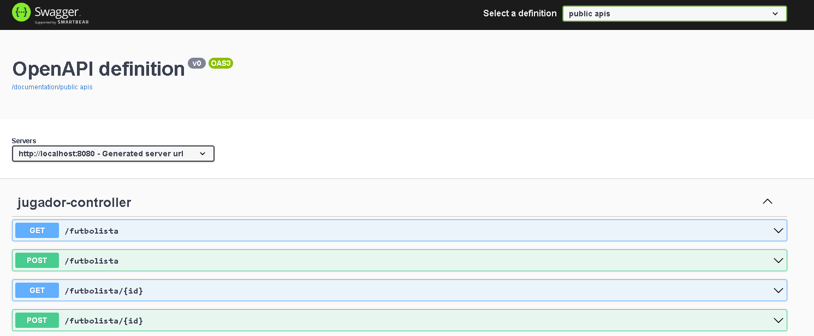

# civa-practice

Este es un repositorio dedicado a la prueba para el puesto de desarrollador Fullstack en la empresa Civa

- **Backend** : app

- **Frontend** : react-proyect-civa

- [civa-practice](#civa-practice)
  - [Herramientas tecnologicas](#herramientas-tecnologicas)
    - [Backend](#backend)
      - [Documentacion](#documentacion)
        - [Endpoint](#endpoint)
    - [Frontend](#frontend)

## Herramientas tecnologicas

### Backend

- Java 17
- Spring boot 3.2
- Mysql

#### Documentacion  

Revisar el aplication properties para ejeutar proyecto

``` properties

server.port=8080
spring.jpa.hibernate.ddl-auto=update
spring.datasource.url=jdbc:mysql://localhost:3306/equipocivafc
spring.datasource.username=root
spring.datasource.password=root

```

##### Endpoint

Se uso Swagger para generar la documentacion de la aplicacion
con la siguente ruta local

<http://localhost:8080/docui>



### Frontend

- Vite
- React 18
- Javacript


comandos para ejecutar el proyecto

- Desarrollo

``` javacript
 npm run dev
```

- Produccion

``` javacript
 npm run build
```

Gracias hecho con 💚🖤
